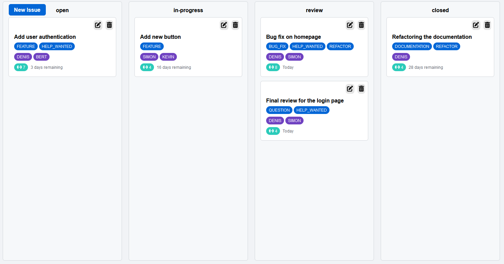

# Issue Board

## Description

This is a simple issue board that allows users to create, edit, and delete issues. You can also move the issue to the desired state (Open, In Progress, Review, Closed). The issues are stored in a simple json file which can be seen as a db. The front-end is build with React and Typescript. The back-end is build with Fast-API and Python.

## Installation

### Front-end

To run the front-end, you need to have Node.js installed. You can download it from [here](https://nodejs.org/en/download/). After installing Node.js, you can run the following commands in the terminal:

```bash
cd client
npm install
npm run dev
```

### Back-end

To run the back-end, I have provided a pipenv file. You can install pipenv by running the following command:

```bash
pip install pipenv
pipenv install
pipenv shell
python ./main.py (to start the server)
```

This is what the issue board looks like with the issues provided in the json file at this current state:



The UI should be self explanatory. You can create, edit, and delete issues with the icons and button provided. You can also move the issues to the desired state by dragging and dropping the issue.

## Future Improvements

- Add an actual database to store the issues
- Add authentication
- Add a search bar to search for issues
- Add a filter to filter issues by state, assignee and label
- Add a feature to show the milestones and the current progress of the milestone and its issues
- Add comment to the issues
...
